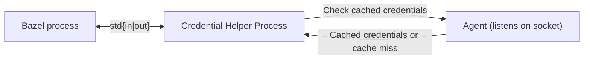
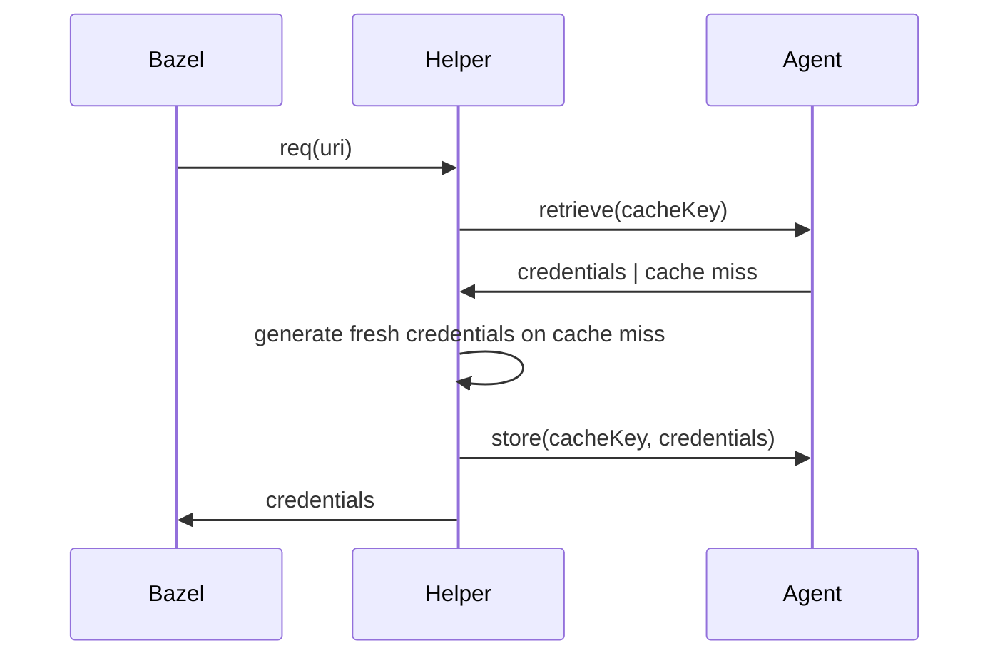

# tweag-credential-helper

*A credential-helper framework and agent for [Bazel](https://bazel.build/) and similar tools implementing the [credential-helper spec][spec].*

Many build tools need access to external resources—such as tarballs from a Git forge, container images, prebuilt artifacts, and large datasets.
Tools like Bazel often require authentication with HTTP servers to download these files.
This project provides a credential helper that automatically injects authentication headers based on the request URI, simplifying the process of securing your build dependencies:
Instead of configuring credentials in your code, a credential helper decouples the authentication of requests from the configuration of external dependencies.

## Key Features

- Credential Agent: An agent (similar to ssh-agent) that starts automatically on first use, caching credentials securely in memory for fast retrieval.
- Smart caching: Reuses cached credentials where possible instead of generating fresh credentials for each URI.
- Batteries Included: Support for popular services out of the box while being easily extensible.
- Framework for Credential Helpers: A Go-based framework to create and manage credential helpers for commonly used cloud services and APIs.
- Cross Platform: Works out of the box on Linux, macOS and Windows (other platforms are untested).

## Architecture



The credential helper follows a simple architecture:

- Bazel invokes a new instance of the credential helper process for each request. The process will receive one request, determine the credentials, write them to stdout and terminate
- In the background, the credential helper spawns a long-running agent process. The agent listens on a unix domain socket and caches credentials in memory.

### Life of a helper request



## Supported providers

The following providers are supported as of today:

- [Remote Execution & Remote Caching Services](/docs/providers/remoteapis.md)
- [AWS S3](/docs/providers/s3.md)
- [Cloudflare R2](/docs/providers/r2.md)
- [Google Cloud Storage (GCS)](/docs/providers/gcs.md)
- [GitHub](/docs/providers/github.md)
- [Container Registries](/docs/providers/oci.md)

## Installation and usage

You can either manually install a binary of the credential helper on your system (into `$PATH` or to a well-known absolute path) or use the Bazel module.
Prebuilt artifacts can be found in the [GitHub releases][releases].
If you want to manually install the helper, skip ahead to the [configuration](#configuration) after installing the binary yourself.

Add the following to your `MODULE.bazel` if you want to perform the recommended installation.
The latest release can always be found on the [Bazel Central Registry][bcr]:

```starlark
bazel_dep(name = "tweag-credential-helper", version = "0.0.5")
```

Then add the shell stub to your own workspace.

```shell-session
mkdir -p tools
wget -O tools/credential-helper https://raw.githubusercontent.com/tweag/credential-helper/main/tools/credential-helper
chmod +x tools/credential-helper
```

Next configure Bazel to use the credential helper by adding the following to your `.bazelrc`:

<details>
<summary>Configuration for Unix only (Linux, macOS)</summary>

```
# GitHub
common --credential_helper=github.com=%workspace%/tools/credential-helper
common --credential_helper=raw.githubusercontent.com=%workspace%/tools/credential-helper
# GCS
common --credential_helper=storage.googleapis.com=%workspace%/tools/credential-helper
# S3
common --credential_helper=s3.amazonaws.com=%workspace%/tools/credential-helper
common --credential_helper=*.s3.amazonaws.com=%workspace%/tools/credential-helper
# Cloudflare R2
common --credential_helper=*.r2.cloudflarestorage.com=%workspace%/tools/credential-helper
```

</details>

<details>
<summary>Configuration for Linux, macOS, and Windows</summary>

```
# allow the use of different credential helpers on Unix and Windows
common --enable_platform_specific_config
common:macos --config=unix
common:linux --config=unix
common:freebsd --config=unix
common:openbsd --config=unix

# GitHub (Unix)
common:unix --credential_helper=github.com=%workspace%/tools/credential-helper
common:unix --credential_helper=raw.githubusercontent.com=%workspace%/tools/credential-helper
# GitHub (Windows)
common:windows --credential_helper=github.com=%workspace%/tools/credential-helper.exe
common:windows --credential_helper=raw.githubusercontent.com=%workspace%/tools/credential-helper.exe

# Google Cloud Storage / GCS (Unix)
common:unix --credential_helper=storage.googleapis.com=%workspace%/tools/credential-helper
# Google Cloud Storage / GCS (Windows)
common:windows --credential_helper=storage.googleapis.com=%workspace%/tools/credential-helper.exe

# S3 (Unix)
common:unix --credential_helper=s3.amazonaws.com=%workspace%/tools/credential-helper
common:unix --credential_helper=*.s3.amazonaws.com=%workspace%/tools/credential-helper
# S3 (Windows)
common:windows --credential_helper=s3.amazonaws.com=%workspace%/tools/credential-helper.exe
common:windows --credential_helper=*.s3.amazonaws.com=%workspace%/tools/credential-helper.exe

# Cloudflare R2 (Unix)
common:unix --credential_helper=*.r2.cloudflarestorage.com=%workspace%/tools/credential-helper
# Cloudflare R2 (Windows)
common:windows --credential_helper=*.r2.cloudflarestorage.com=%workspace%/tools/credential-helper.exe
```

</details>

Simply remove a line if you do not want the credential helper to be used for that service.
You can also configure the helper to be used for every domain (`--credential_helper=%workspace%/tools/credential-helper`).

Now is a good time to install the credential helper. Simply run `bazel run @tweag-credential-helper//installer` to add the binary to your system. This step needs to be performed once per user.
Alternatively, you can [write custom plugins that are part of your own Bazel workspace and build your own helper][plugins].

Follow the [provider-specific documentation](/docs/providers/) to ensure you can authenticate to the service.
In most cases, you the credential helper can guide you through the required setup for a URL with the following command:

```
tools/credential-helper setup-uri <URL>
```

You can also look at the [example project](/examples/full/) to see how everything works together.

## Configuration

The credential helper has sensible defaults out of the box. If needed, you can use environment variables or a configuration file to change settings.

## Config file

By default, the configuration file is located in the workspace directory (the directory where your MODULE.bazel is located or your current working directory) and is named `.tweag-credential-helper.json`.
You can override the config file location using the `$CREDENTIAL_HELPER_CONFIG_FILE` environment variable.

- `.urls`: list of configurations to apply to different patterns of urls. Each element contains `scheme`, `host`, and `path` as a way to decide if the entry matches the requested url.
- `.urls[].scheme`: Scheme of the url. Matches any scheme when empty and checks for equality otherwise.
- `.urls[].host`: Host of the url. Matches any host when empty and uses globbing otherwise (a `*` matches any characters).
- `.urls[].path`: Path of the url. Matches any path when empty and uses globbing otherwise (a `*` matches any characters).
- `.urls[].helper`: Helper to use for this url. Can be one of `s3`, `gcs`, `github`, `oci` or `null`.
- `.urls[].config`: Optional helper-specific configuration. Refer to the documentation of the chosen helper for more information.
- `.urls[].config.lookup_chain`: Most helpers support configurable sources for secrets. Consult [the documenation on lookup chains][lookup_chain] for more information.

### Example

`.tweag-credential-helper.json`:
```
{
  "urls": [
    {
      "scheme": "https",
      "host": "github.com",
      "path": "/tweag/*",
      "helper": "github",
      "config": {
        "read_config_file": false
      }
    },
    {
      "scheme": "https",
      "host": "files.acme.corp",
      "path": "*.tar.gz",
      "helper": "s3",
      "config": {
        "region": "us-east-1"
      }
    },
    {
      "host": "*.oci.acme.corp",
      "helper": "oci"
    },
    {
      "host": "bazel-remote.acme.com",
      "helper": "remoteapis",
      "config": {
        "auth_method": "basic_auth",
        "lookup_chain": [
            {
                "source": "env",
                "name": "CREDENTIAL_HELPER_REMOTEAPIS_SECRET"
            },
            {
                "source": "keyring",
                "service": "tweag-credential-helper:remoteapis"
            }
        ]
      }
    }
  ]
}
```

In this example requests to any path below `https://github.com/tweag/` would use the GitHub helper, any requests to `https://files.acme.corp` that end in `.tar.gz` would use the S3 helper, while any requests to a subdomain of `oci.acme.corp` would use the oci helper.
Additionally, a `baze-remote` instance can be used as a remote cache.

## Environment variables

You can also use environment variables to configure the helper.
This works by either changing the environment Bazel is started with or by adding the values to the shell stub (that is only available on Linux and macOS).

The following options exist:

- `$CREDENTIAL_HELPER_STANDALONE`:
  If set to 1, the credential helper will run in standalone mode, which means it will not start or connect to the agent process.
- `$CREDENTIAL_HELPER_BIN`:
  Path of the credential helper binary. If not set, the helper will be searched in `${HOME}/.cache/tweag-credential-helper/<HASH>/bin/credential-helper`
- `$CREDENTIAL_HELPER_AGENT_SOCKET`
  Path of the agent socket. Subject to [prefix expansion](#prefix-expansion). If not set, the helper will use the default path `${HOME}/.cache/tweag-credential-helper/<HASH>/run/agent.sock`.
- `$CREDENTIAL_HELPER_AGENT_PID`:
  Path of the agent pid file. Subject to [prefix expansion](#prefix-expansion). If not set, the helper will use the default path `${HOME}/.cache/tweag-credential-helper/<HASH>/run/agent.pid`
- `$CREDENTIAL_HELPER_LOGGING=off|basic|debug`
  Log level of the credential helper. Debug may expose sensitive information. Default is off.
- `$CREDENTIAL_HELPER_IDLE_TIMEOUT`:
  Idle timeout of the agent in [Go duration format][go_duration]. The agent will run in the background and wait for connections until the idle timeout is reached. Defaults to 3h. A negative value disables idle shutdowns.
- `$CREDENTIAL_HELPER_PRUNE_INTERVAL`:
  Duration between cache prunes in [Go duration format][go_duration]. Defaults to 1m. A negative value disables cache pruning.
- `$CREDENTIAL_HELPER_GUESS_OCI_REGISTRY`:
  If set to 1, the credential helper will allow any uri that looks like a container registry to obtain authentication tokens from the docker `config.json`. If turned off, only a well-known subset of registries is supported.
- `$CREDENTIAL_HELPER_CONFIG_FILE`:
  Path of the optional configuration file. Subject to [prefix expansion](#prefix-expansion). If not set, the helper will use the default path `%workspace%/.tweag-credential-helper.json`.

Additionally, you can configure how the installer behaves by adding any of the following settings to your `.bazelrc`:

- `--@tweag-credential-helper//bzl/config:helper_build_mode={auto,from_source,prebuilt}`:
  Configures how the credential helper is built and whether or not a Go toolchain is required. The `prebuilt` setting only allows downloading a preregistered and prebuilt helper binary. This is fast and doesn't require a Go toolchain, but may fail if no prebuilt binary for your host platform is available. `from_source` forces building the `go_binary` from source and requires registering a Go toolchain. `auto` (the default) prefers the use of a prebuilt, but allows falling back to building from source.
- `--@tweag-credential-helper//bzl/config:default_install_destination_unix=<path>`:
  Configures the install destination of the credential helper on Unix (Linux, macOS). Subject to [prefix expansion](#prefix-expansion). Defaults to `%workdir%/bin/credential-helper`, which is the path used by the shell wrapper. If you set this to a workspace relative path like `%workspace%/tools/my-helper-binary`, (add that path to `.gitignore`) and point `--credential_helper` to the same path, you can avoid using the shell wrapper but modify the source tree instead.
- `--@tweag-credential-helper//bzl/config:default_install_destination_windows=<path>`:
  Configures the install destination of the credential helper on Windows. Subject to [prefix expansion](#prefix-expansion). Defaults to `%workspace%\tools\credential-helper.exe`, which is the path used in `.bazelrc` by default.
  Windows cannot make use of the shell wrapper, so this binary is copied to the source tree instead of a path relative to the workdir.

### <a name="prefix-expansion"></a> Prefix Expansion

Configuration options (including environment variables and Bazel flags) that refer to paths are subject to prefix expansion. Special prefixes listed below will be replaced by concrete paths at runtime.

- `%workdir%`: the working directory of the agent process:
  `${XDG_CACHE_HOME}/tweag-credential-helper/<HASH>` (where `$XDG_CACHE_HOME` defaults to `${HOME}/.cache` on Linux and `<HASH>` is the md5 sum of the absolute dirname of the directory containing `MODULE.bazel`).
- `%workspace%`: the root of the Bazel workspace (absolute dirname of the directory containing `MODULE.bazel`).
- `%tmp%`: either `$TEST_TMPDIR`, `$TMPDIR`, or `/tmp` in that order of preference.
- `%cache%`: `$XDG_CACHE_HOME` (which defaults to `${HOME}/.cache` on Linux).
- `~`: `$HOME` (the home directory of the current user).

## Troubleshooting

1. Stop the agent (if it is running in the background)
    ```
    tools/credential-helper agent-shutdown
    ```
2. Start the agent in a separate terminal
    ```
    CREDENTIAL_HELPER_LOGGING=debug tools/credential-helper agent-launch
    ```
3. Run Bazel with the `CREDENTIAL_HELPER_LOGGING` environment variable
    ```
    export CREDENTIAL_HELPER_LOGGING=debug
    bazel ...
    ```
4. Alternatively, you can also pipe a raw request to the agent
    ```
    echo '{"uri": "https://example.com/foo"}' | CREDENTIAL_HELPER_LOGGING=debug tools/credential-helper get
    ```

## Hacking & Contributing

We invite external contributions and are eager to work together with the build systems community.
Please refer to the [CONTRIBUTING](/docs/CONTRIBUTING.md) guide to learn more.
If you want to check out the code and run a development version, follow the [HACKING](/docs/HACKING.md) guide to get started.

## Security Considerations

In most circumstances, a credential helper improves security by decoupling resource configuration from the credentials required to access them. This reduces the need for hardcoded credentials stored in source code, minimizing potential security vulnerabilities.

### Credential Handling

The credential helper spawns two processes:

1. **A short-lived client process** that communicates with the caller via standard input and output.
2. **An agent process** that caches credentials and implements a JSON-RPC protocol via Unix domain sockets.

Credentials are cached only in memory (never written to disk). The client process exists only for the duration of a single request (e.g., obtaining credentials for a specific URI). Meanwhile, the agent process runs in the background and idles for up to three hours before automatically shutting down.

The agent evicts expired credentials from the cache once per minute but does not guarantee the secure scrubbing of memory. As a result, while expired credentials are no longer accessible through the agent socket, they may still reside in physical memory for some time before being reclaimed by garbage collection or the operating system.

### Attack Surface

Both processes run with the same privileges as the user who starts Bazel (or similar tools). Any credentials derived by the helper are also accessible to that user through environment variables, configuration files, the system keyring, or similar sources.

Any information retrievable by the user running the helper process does not constitute a disclosure of sensitive information. Instead, this section focuses on the attack surface exposed to other users on the same system.

#### JSON-RPC via Unix Domain Socket

The caching agent implements a simple RPC protocol that is accessible via a socket.
The socket’s access permissions are configured to restrict connections only to the user running the agent. This is enforced by setting a `umask` on the agent process before creating the socket.

The agent does not implement additional countermeasures. Consequently, access to the socket provides full read and write permissions for cached credentials.

[spec]: https://github.com/EngFlow/credential-helper-spec
[releases]: https://github.com/tweag/credential-helper/releases
[go_duration]: https://pkg.go.dev/time#ParseDuration
[plugins]: /docs/plugins.md
[bcr]: https://registry.bazel.build/modules/tweag-credential-helper
[lookup_chain]: /docs/lookup_chain.md
