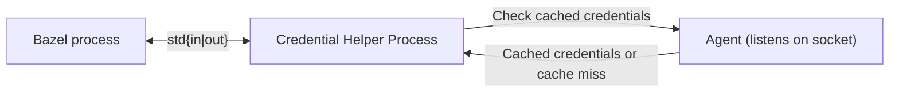
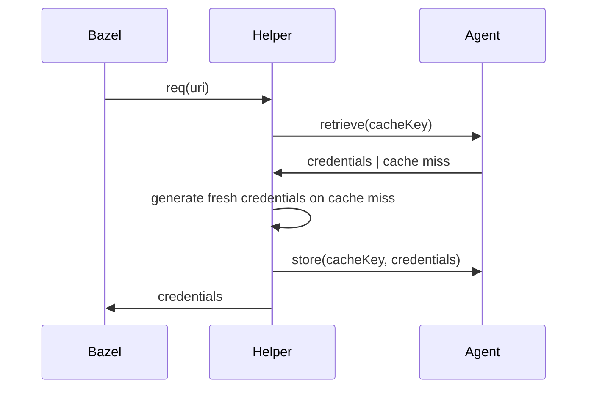

# credential-helper

A credential-helper framework and agent for [Bazel](https://bazel.build/) and similar tools implementing the [credential-helper spec][spec].

## Key Features

- Credential Agent: An agent (similar to ssh-agent) that starts automatically on first use, caching credentials securely in memory for fast retrieval.
- Smart caching: Reuses cached credentials where possible instead of generating fresh credentials for each URI.
- Batteries Included: Support for popular services out of the box while being easily extensible.
- Framework for Credential Helpers: A Go-based framework to create and manage credential helpers for commonly used cloud services and APIs.

## Architecture



The credential helper follows a simple architecture:

- Bazel invokes a new instance of the credential helper process for each request. The process will receive one request, determine the credentials, write them to stdout and terminate
- In the background, the credential helper spawns a long-running agent process. The agent listens on a unix domain socket and caches credentials in memory.

### Life of a helper request



## Supported providers

The following providers are supported as of today:

- [AWS S3](/docs/providers/s3.md)
- [Cloudflare R2](/docs/providers/r2.md)
- [Google Cloud Storage (GCS)](/docs/providers/gcs.md)
- [GitHub](/docs/providers/github.md)

## Installation and usage

You can either install a prebuilt binary of the credential helper on your system or use a Bazel module.
Prebuilt artifacts can be found in the [GitHub releases][releases].
If you want to use prebuilt artifacts, skip ahead to the [configuration](#configuration) after installing the binary yourself.

Add the following to your `MODULE.bazel` if you want to perform the recommended installation:

```starlark
bazel_dep(name = "tweag-credential-helper", version = "0.0.1")
```

Then add the shell stub to your own workspace.

```shell-session
mkdir -p tools
wget -O tools/credential-helper https://raw.githubusercontent.com/tweag/credential-helper/main/tools/credential-helper
chmod +x tools/credential-helper
```

Next configure Bazel to use the credential helper by adding the following to your `.bazelrc`:

```
# GitHub
common --credential_helper=github.com=%workspace%/tools/credential-helper
common --credential_helper=raw.githubusercontent.com=%workspace%/tools/credential-helper
# GCS
common --credential_helper=storage.googleapis.com=%workspace%/tools/credential-helper
# S3
common --credential_helper=s3.amazonaws.com=%workspace%/tools/credential-helper
common --credential_helper=*.s3.amazonaws.com=%workspace%/tools/credential-helper
# Cloudflare R2
common --credential_helper=*.r2.cloudflarestorage.com=%workspace%/tools/credential-helper
```

Simply remove a line if you do not want the credential helper to be used for that service.
You can also configure the helper to be used for every domain (`--credential_helper=%workspace%/tools/credential-helper`).

Now is a good time to install the credential helper. Simply run `bazel run @tweag-credential-helper//installer` to add the binary to your system. This step needs to be performed once per user.
Alternatively, you can [write custom plugins that are part of your own Bazel workspace and build your own helper][plugins].

Follow the [provider-specific documentation](/docs/providers/) to ensure you can authenticate to the service.

## Configuration

You can use environment variables to configure the helper.
This works by either changing the environment Bazel is started with or by adding the values to the shell stub.

The following options exist:

- `$CREDENTIAL_HELPER_STANDALONE`:
  If set to 1, the credential helper will run in standalone mode, which means it will not start or connect to the agent process.
- `$CREDENTIAL_HELPER_BIN`:
  Path of the credential helper binary. If not set, the helper will be searched in `${HOME}/.cache/tweag-credential-helper/bin/credential-helper`
- `$CREDENTIAL_HELPER_AGENT_SOCKET`
  Path of the agent socket. If not set, the helper will use the default path `${HOME}/.cache/tweag-credential-helper/run/agent.sock`.
- `$CREDENTIAL_HELPER_AGENT_PID`:
  Path of the agent pid file. If not set, the helper will use the default path `${HOME}/.cache/tweag-credential-helper/run/agent.pid`
- `$CREDENTIAL_HELPER_LOGGING=off|basic|debug`
  Log level of the credential helper. Debug may expose sensitive information. Default is off.
- `$CREDENTIAL_HELPER_IDLE_TIMEOUT`:
  Idle timeout of the agent in [Go duration format][go_duration]. The agent will run in the background and wait for connections until the idle timeout is reached. Defaults to 3h. A negative value disables idle shutdowns.
- `$CREDENTIAL_HELPER_PRUNE_INTERVAL`:
  Duration between cache prunes in [Go duration format][go_duration]. Defaults to 1m. A negative value disables cache pruning.

## Troubleshooting

1. Stop the agent (if it is running in the background)
    ```
    tools/credential-helper agent-shutdown
    ```
2. Start the agent in a separate terminal
    ```
    CREDENTIAL_HELPER_LOGGING=debug tools/credential-helper agent-launch
    ```
3. Run Bazel with the `CREDENTIAL_HELPER_LOGGING` environment variable
    ```
    export CREDENTIAL_HELPER_LOGGING=debug
    bazel ...
    ```
4. Alternatively, you can also pipe a raw request to the agent
    ```
    echo '{"uri": "https://example.com/foo"}' | CREDENTIAL_HELPER_LOGGING=debug tools/credential-helper get
    ```

## Security Considerations  

In most circumstances, a credential helper improves security by decoupling resource configuration from the credentials required to access them. This reduces the need for hardcoded credentials stored in source code, minimizing potential security vulnerabilities.  

### Credential Handling  

The credential helper spawns two processes:  

1. **A short-lived client process** that communicates with the caller via standard input and output.  
2. **An agent process** that caches credentials and implements a JSON-RPC protocol via Unix domain sockets.  

Credentials are cached only in memory (never written to disk). The client process exists only for the duration of a single request (e.g., obtaining credentials for a specific URI). Meanwhile, the agent process runs in the background and idles for up to three hours before automatically shutting down.  

The agent evicts expired credentials from the cache once per minute but does not guarantee the secure scrubbing of memory. As a result, while expired credentials are no longer accessible through the agent socket, they may still reside in physical memory for some time before being reclaimed by garbage collection or the operating system.  

### Attack Surface  

Both processes run with the same privileges as the user who starts Bazel (or similar tools). Any credentials derived by the helper are also accessible to that user through environment variables, configuration files, the system keyring, or similar sources.  

Any information retrievable by the user running the helper process does not constitute a disclosure of sensitive information. Instead, this section focuses on the attack surface exposed to other users on the same system.  

#### JSON-RPC via Unix Domain Socket  

The caching agent implements a simple RPC protocol that is accessible via a socket.  
The socket’s access permissions are configured to restrict connections only to the user running the agent. This is enforced by setting a `umask` on the agent process before creating the socket.  

The agent does not implement additional countermeasures. Consequently, access to the socket provides full read and write permissions for cached credentials.

[spec]: https://github.com/EngFlow/credential-helper-spec
[releases]: https://github.com/tweag/credential-helper/releases
[go_duration]: https://pkg.go.dev/time#ParseDuration
[plugins]: /docs/plugins.md