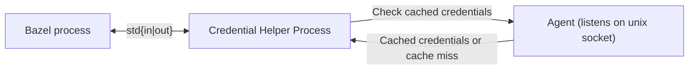
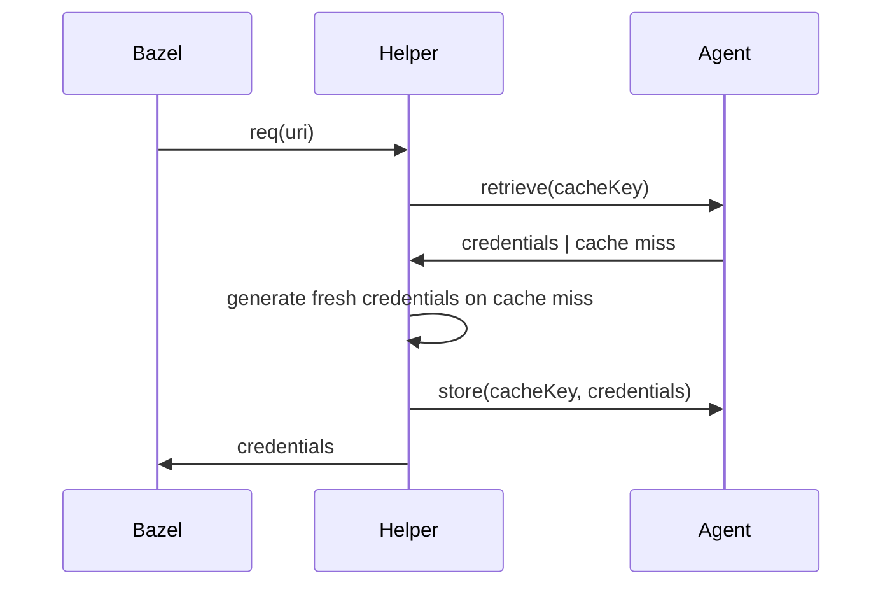

# credential-helper

A framework and agent for the [credential-helper spec][spec].

## Key Features

- Credential Agent: An agent (similar to ssh-agent) that starts automatically on first use, caching credentials securely in memory for fast retrieval.
- Smart caching: Reuses cached credentials where possible instead of generating fresh credentials for each URI.
- Batteries Included: Support for popular services out of the box while being easily extensible.
- Framework for Credential Helpers: A Go-based framework to create and manage credential helpers for commonly used cloud services and APIs.

## Architecture



The credential helper follows a simple architecture:

- Bazel invokes a new instance of the credential helper process for each request. The process will receive one request, determine the credentials, write them to stdout and terminate
- In the background, the credential helper spawns a long-running agent process. The agent listens on a unix domain socket and caches credentials in memory.

### Life of a helper request



## Supported providers

The following providers are supported as of today:

- AWS S3
- Google Cloud Storage
- GitHub

## Installation and usage

You can either install a prebuilt binary of the credential helper on your system or use a Bazel module.
Prebuilt artifacts can be found in the [GitHub releases][releases].
If you want to use prebuilt artifacts, skip ahead to the [configuration](#configuration) after installing the binary yourself.

Add the following to your `MODULE.bazel` if you want to perform the recommended installation:

```starlark
bazel_dep(name = "credential-helper", version = "0.0.1")
```

Then add the shell stub to your own workspace.

```shell-session
mkdir -p tools
wget -O tools/credential-helper https://raw.githubusercontent.com/tweag/credential-helper/main/tools/credential-helper
chmod +x tools/credential-helper
```

Next configure Bazel to use the credential helper by adding the following to your `.bazelrc`:

```
# GitHub
common --credential_helper=github.com=%workspace%/tools/credential-helper
# GCS
common --credential_helper=storage.googleapis.com=%workspace%/tools/credential-helper
# S3
common --credential_helper=s3.amazonaws.com=%workspace%/tools/credential-helper
common --credential_helper=*.s3.amazonaws.com=%workspace%/tools/credential-helper
```

Simply remove a line if you do not want the credential helper to be used for that service.
You can also configure the helper to be used for every domain (`--credential_helper=%workspace%/tools/credential-helper`).

Now is a good time to install the credential helper. Simply run `bazel run @credential-helper//installer` to add the binary to your system. This step needs to be performed once per user.

## Configuration

You can use environment variables to configure the helper.
This works by either changing the environment Bazel is started with or by adding the values to the shell stub.

The following options exist:

- `$CREDENTIAL_HELPER_STANDALONE`:
  If set to 1, the credential helper will run in standalone mode, which means it will not start or connect to the agent process.
- `$CREDENTIAL_HELPER_BIN`:
  Path of the credential helper binary. If not set, the helper will be searched in `${HOME}/.cache/credential-helper/bin/credential-helper`
- `$CREDENTIAL_HELPER_AGENT_SOCKET`
  Path of the agent socket. If not set, the helper will use the default path `${HOME}/.cache/credential-helper/run/agent.sock`.
- `$CREDENTIAL_HELPER_AGENT_PID`:
  Path of the agent pid file. If not set, the helper will use the default path `${HOME}/.cache/credential-helper/run/agent.pid`
- `$CREDENTIAL_HELPER_LOGGING=off|basic|debug`
  Log level of the credential helper. Debug may expose sensitive information. Default is off.


## Troubleshooting

1. Stop the agent (if it is running in the background)
    ```
    tools/credential-helper agent-shutdown
    ```
2. Start the agent in a separate terminal
    ```
    CREDENTIAL_HELPER_LOGGING=debug tools/credential-helper agent-launch
    ```
3. Run Bazel with the `CREDENTIAL_HELPER_LOGGING` environment variable
    ```
    export CREDENTIAL_HELPER_LOGGING=debug
    bazel ...
    ```
4. Alternatively, you can also pipe a raw request to the agent
    ```
    echo '{"uri": "https://example.com/foo"}' | CREDENTIAL_HELPER_LOGGING=debug tools/credential-helper get
    ```

[spec]: https://github.com/EngFlow/credential-helper-spec
[releases]: https://github.com/tweag/credential-helper/releases
